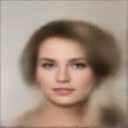
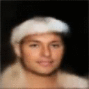
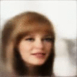
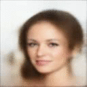
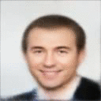
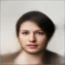
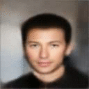
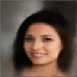
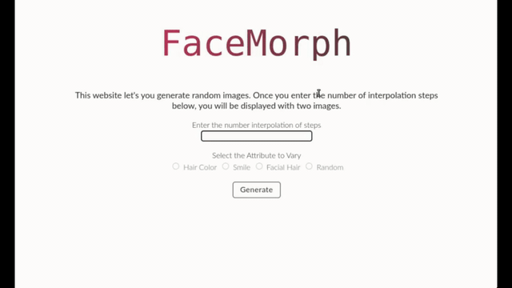

# FaceMorph - An interactive website for generating and manipulating facial attributes

<b>FaceMorph</b> uses Deep Learning to generate faces. It allows for manipluation of facial features such as hair color, facial hair, and degree of smile. The website is designed and developed using HTML, CSS and JS. Flask is used to deploy the deep learning model online for real-time interaction. 

## Learning Disentangled Representations using VAEs conditioned on Structural Similarity 

The underlying model devloped is a <b>Variational Autoencoder</b> whose cost function is modified for better reconstructions. The Vanilla VAE is a explicit generative model, that learns to compress input data to a low dimensional space. This low dimensional space also known as the <b>latent space</b>, in general is not well defined if a naive implementation of an Encoder-Decoder network with a reconstruction objective is trained. Hence VAEs impose a prior on the latent space, the normal distribution is a suitable prior for simlplicity. The prior is then imposed into the objective using KL-Divergence between a normal distribution and the the distribution estimated by the Encoder. Although the Vanilla VAE is capable of producing decent reconstructions, there is room for improvement. In general there is a tradeoff between the quality of reconstruction and how well defined the latent space is. To imporve the reconstructions, with minimal loss in latent space represnetation, I use the Multiscale SSIM loss, as the reconstruction objective. This producesd visually better reconstructions compared to the Vanilla VAE, with a fairly disentangled latent space.

## Analyzing the learned latent representations

The model is trained on the CelebA dataset, which consists of 200k images of celebrity faces. The dataset also contains a set of facial attributes(Gender, Hair Color, Facial Hair, Hair Style, etc) that can be used to group the images in the dataset. I analyze the degree of disentanglement in representation with the help of these attributes. Once the latent vectors on images with a specific attribute is computed, we can estimate the mean latent vector of the attribute. Then using vector arithmetic, we can simply add the mean latent vector to an image that lacks said attribute. If the latent space is well defined, then this operation would generate a reconstruction that includes this attribute in the image.  Below is a Table with different attributes gradually being introduced to the image (Facial Hair, Hair Color, Degree of Smile).

|                Hair Color           |       Facial Hair       |          Smile          |      Random Morphing     |
|:-----------------------------------:|:-----------------------:|:-----------------------:|:------------------------:|
|       |||  |
|         |||  |

## FaceMorph Demo
Here is a Demo of the website, which uses the model described above. I learned a bit of JS and AJAX from developing this website and also how Flask can be used to deploy such models. While there is a lot of room for imporvment, when it comes to the design and responsiveness of the website, I am happy with how it has turned out. There will be updates to the website in this regard

Here is the [Colab Notebook](https://colab.research.google.com/drive/1EFc4onUIibLTX6BDWFT_b04oN6xlYEPQ?usp=sharing), with Flask Webapp and model implemented on PyTorch.

