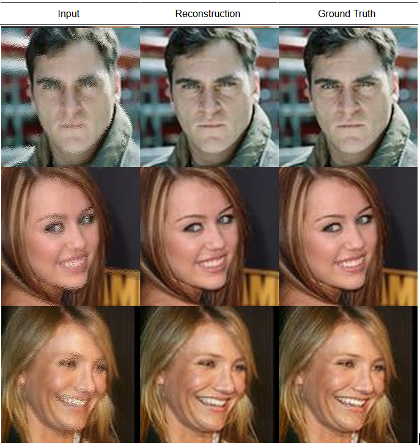

# Image Restoration Using Generative Adversarial Networks

## Problem Statement

Given a distorted image from the Public Figures Dataset. Use a Deep Learning model to correct the distortions and restore the original image. While this is a fairly straightforward problem statement, the intention of the project is to analyse the performance of standard Fully Convolutional Neural Networks with/without Adversarial Training.

## Method of Image Distortion 

For every pixel in the image a 5x5 kernel is applied around it. The kernel randomly switches pixels positions while traversing the entire image. This results in visual artifacts similar to grain. There is no external noise component added to the image as such. Givne this outline, we can control the rate at which the pixels are shuffled, therefore I had created two versions of the dataset. One with high distortion, and one with lower distortion.

## Problems Faced while training GANs

Training GANs is not quite tricky and involves multiple failed experiments before the model is able to acheive stability. Here are some of the things that I employed in order to train the GAN model. 
 <ul>
  <li>Plotting and tracking the loss of both the Generator and Discriminator can give you a lot of insight on what is going on, when the training fails.
  </li>
  <li>I found the Discriminator is able to distinguish between both samples(real/fake) with ease. This can be identified from the plot of the losses. One such indication is if the loss of the Discriminator is low and the Generator is high (sometimes diverges). You can also look at the reconstructions from the Generator to get an idea or also plot metrics like PSNR/SSIM between the Ground Truth and Reconsturcted Image
  </li>
  <li> To mitigate this, I lowered the learning rate of the Discriminator. This ensures that the Discriminator's learning process is slowed down, and the Generator is able to produce better samples.
  </li>
  <li> Another approach is to make the Discriminator objective more difficult. One way, is to make the Discriminator predict a patch rather than just a single class probability. This ensures that the receptive field of the Discriminator is not reduced to just a single number. If not, a single pixel or a small region of pixels might influenece the prediction.
  </li>
  <li> Also, using mixed image pairs apart from the Ground Truth-Reconstruction pairs to train the disciminator helps as well.
  </li>
 </ul>

## Experiments

<ul>
<li>The Generator objective, in the inital stages included the GAN loss and L1 loss for reconstruction. Based on the results being blurry.
</li> 
<li>I added the multiscale SSIM loss, this ensured that the sturctural integrity of the image is maintained. The SSIM loss takes into account the Structure, Contrast and Luminance of the Ground Truth and Reconstructions. This is calculated using a Gaussian Window, which traverses the entire image. The SSIM components are then calculated using the resulting mean and variances obtained from the convolutions with the Gaussian Window.
</li>
<li>Finally, since the SSIM loss operates on Grayscale images, the reconstructions had discolorations occasionally. Therefore I included the cosine similarity loss. This treats the pixels as vectors in the RGB space, if the pixel vector for the Reconstruction and its corresponding Ground Truth are in the same direction (small angle between them) then the cosine similarity loss is low. This ensures color similarity to mitigate the discoloration from SSIM loss.
</li>
</ul>

## Quantitative Results

### Ablation Studies for Loss Functions

|                Losses               | PSNR (High Distortion | PSNR (Low Distortion) |
|:-----------------------------------:|:---------------------:|:---------------------:|
|           L1 + Adversarial          |        31.66 dB       |        34.93 dB       |
|      L1 + MS-SSIM + Adversarial     |        34.30 dB       |        37.47 dB       |
| L1 + MS-SSIM + Cosine + Adversarial |        37.68 dB       |        40.67 dB       |

### Adversarial Training contribution

|                Losses               | PSNR (High Distortion) | PSNR (Low Distortion) |
|:-----------------------------------:|:----------------------:|:---------------------:|
|        L1 + MS-SSIM + Cosine        |        35.67 dB        |        36.55 dB       |
| L1 + MS-SSIM + Cosine + Adversarial |        37.68 dB        |        40.67 dB       |

## Qualitative Results

### Low Distortion (L1 + MS-SSIM + Cosine + Adversarial)

| Input | Reconstruction | Ground Truth |

### High Distortion (L1 + MS-SSIM + Cosine + Adversarial)

| Input | Reconstruction | Ground Truth |
|:-----:|:--------------:|:------------:|

