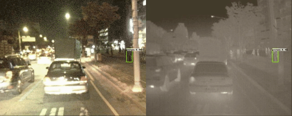

# Multispectral FCOS: Fully Convolutional One-Stage Object Detection     

## Abstract

This method is inspired by <a href="https://arxiv.org/abs/1904.01355"><b>FCOS: Fully Convolutional One-Stage Object Detection</b></a>, the implementation is derived from <a href="https://github.com/DetectionTeamUCAS/FCOS_Tensorflow"><b>DetectionTeamUCAS</b></a>.

         
## Current Implementation
    

## Results Obtained
         

## Results Day

## Results Night

