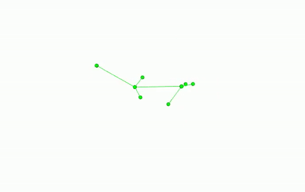
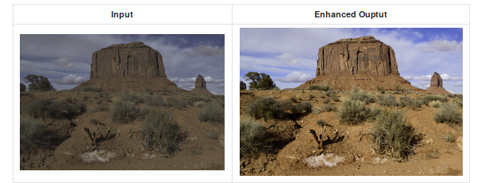
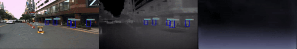
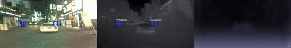
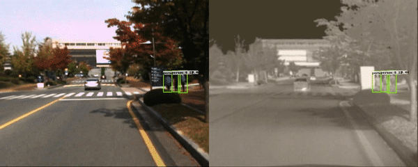
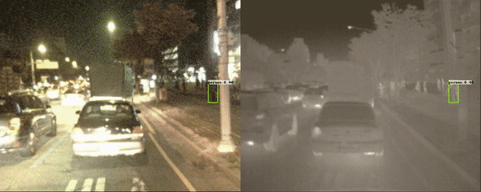

# Research Projects
---
### [Mouse3D: A Comprehensive Multiview Dataset for Mice Behaviors](https://anushl9o5.github.io/Mouse3D)

---
### [Robot Teleoperation using 3D Pose Estimation](https://anushl9o5.github.io/robot_teleop)

---
### [Aesthetic Enhancement of Images](https://anushl9o5.github.io/aesthetic)

---
### All Day Depth Estimation | [Unsupervised](https://anushl9o5.github.io/unsup_depth) | [Supervised](https://anushl9o5.github.io/sup_depth) |    
#### Day

#### Night

--- 

### [Anchorless Pedestrian Detection](https://anushl9o5.github.io/pedestrian)
#### Day

#### Night

---
