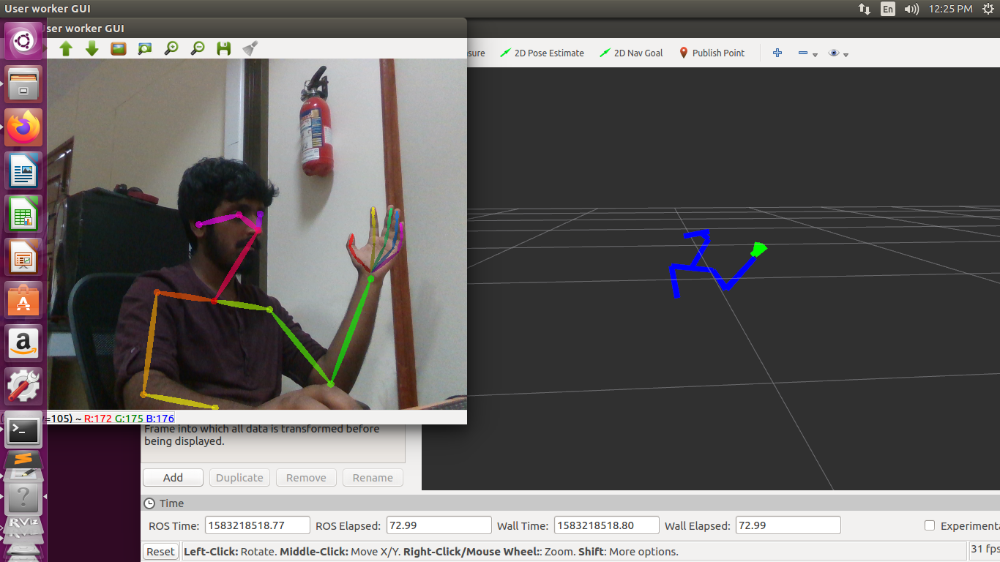
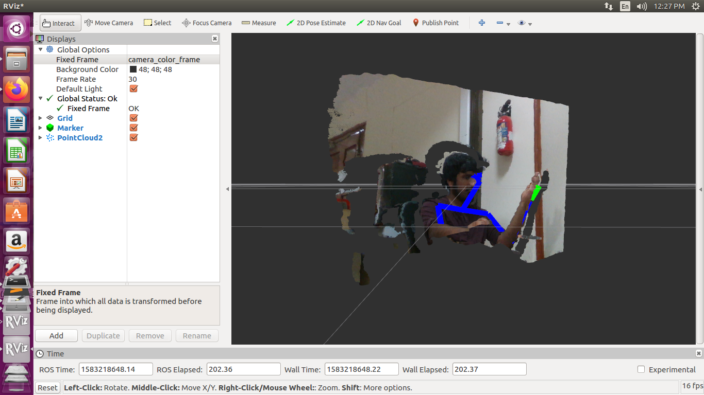

# Robot Teleoperation using 3D Pose Estimation

## 3D Pose Estimation

The pose estimation pipeline is derived from Openpose, an opensource Pose estimation package from CMU. The technique is roboust to varying lighting conditions and human skin color as well. The original package contains options to include hand pose and head pose estimation in addition to the original body pose. All the above mentioned pose estimates are in 2D. 
A 3D based extension was implemented on ROS. This package recieves the 2D pose estimates and projects them onto a depth image from an RGB-D camera (Realsense D415). The corresponding depth and 2D estimates are converted to world coordinates, using intrinsic camera parameters.

[OpenPose - 3D](https://github.com/anushl9o5/openpose_ros)

## Teleoperation

The PyBullet Simulator is used to create an environment to test the teleoperation. The environment loads a UR5 robotic arm, which is controlled using the world coordinates obtained from the 3D pose estimate. The keypoints from the pose can be mapped to both end-effector and elbow joints to mimic human like motion, or just mapped to the end-effector alone. The technique works on other robots like Baxter and Panda, as well. The project is aimed to achieve a complete teleoperation using only 3D pose estimates from a single RGB-D camera. One of the shortcomings currently being addresed is the lack of accuracy at the hands and fingers, which renders control of the end-effector DOFs (Roll, Pitch & Grip) difficult.

### Demo

 
